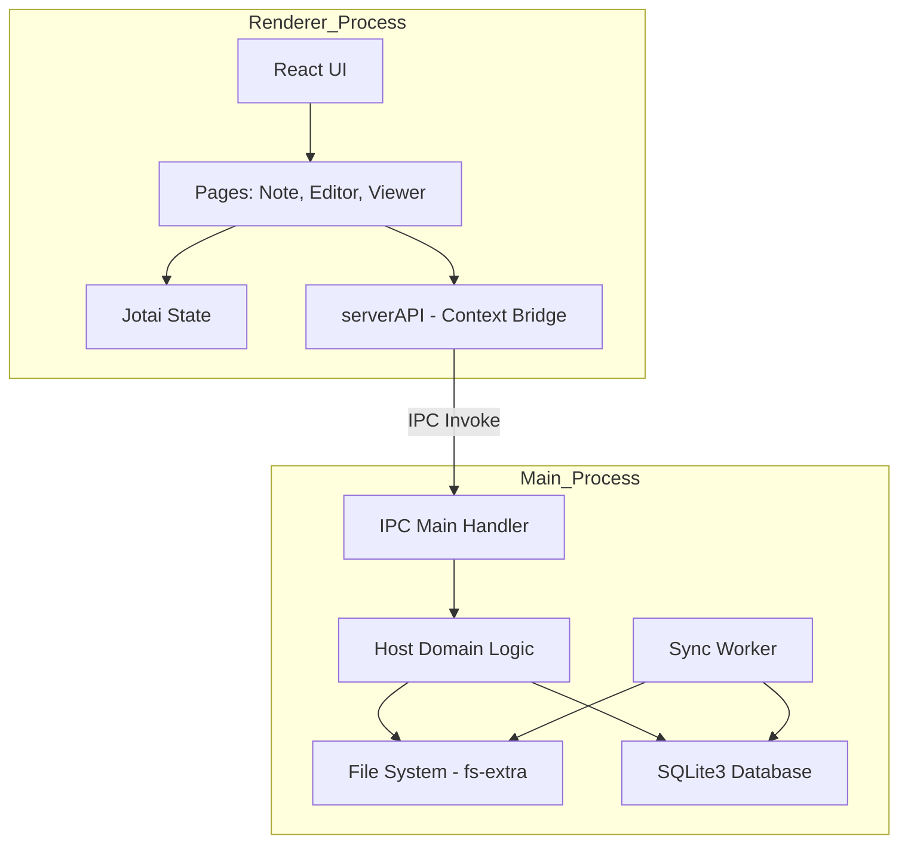

# 希波笔记 (Thunder)

希波笔记（Thunder）是一个基于 Electron 架构的桌面笔记应用程序，旨在为 Polaris 项目提供高效的本地笔记管理方案。它支持 Markdown 编辑与预览，并具备自动化的本地文件系统与 SQLite 数据库同步功能。

## 核心特性

- **Markdown 支持**：内置强大的 Markdown 编辑器和渲染引擎（基于 `marked` 和 `prismjs`）。
- **双向同步**：自动扫描本地文件系统中的 `.md` 文件及 `.note` 目录，并同步至本地 SQLite 数据库以支持快速检索。
- **本地优先**：所有数据存储在本地，确保隐私与离线可用性。
- **跨平台**：基于 Electron 构建，支持 Windows, macOS 和 Linux。
- **现代化 UI**：使用 React 19 和 Material UI (MUI) 构建，响应式布局。

## 技术栈

- **Frontend**: React 19, TypeScript, Vite, Jotai (状态管理), Emotion (CSS-in-JS)
- **Backend (Main Process)**: Electron, Node.js, SQLite3
- **Tools**: Electron Forge, TypeScript, ESLint

## 项目架构



## 目录结构说明

- `src/main.ts`: Electron 主进程入口，负责窗口管理和 IPC 监听。
- `src/preload.ts`: 预加载脚本，安全地暴露后端 API 给渲染进程。
- `src/renderer.tsx`: 渲染进程入口，React 应用根节点。
- `src/pages/`: 包含所有页面组件（笔记列表、编辑器、预览器等）。
- `src/services/`: 核心业务逻辑。
    - `host/`: 主进程服务，处理数据库操作、文件系统同步。
    - `client/`: 渲染进程服务。
    - `common/`: 通用模型和类型定义。
- `public/`: 静态资源（图标、字体、图片）。

## 开发指南

### 环境要求

- Node.js (建议 v18+)
- npm 或 yarn

### 安装依赖

```bash
npm install
```

### 启动开发环境

```bash
npm start
```

### 构建应用

```bash
npm run make
```

## 待办事项 (Roadmap)

- [ ] 完善全文搜索功能
- [ ] 支持更多笔记附件格式
- [ ] 增强多语言支持 (i18n)
